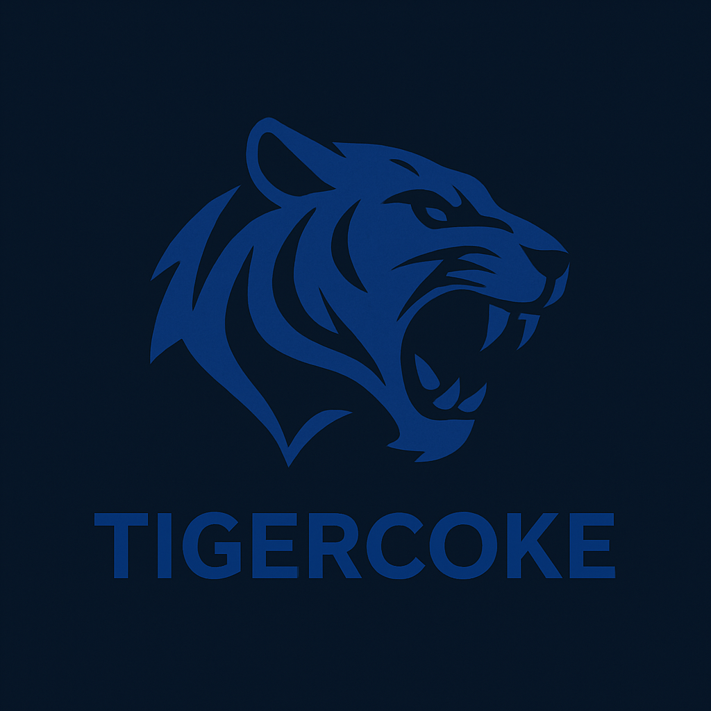
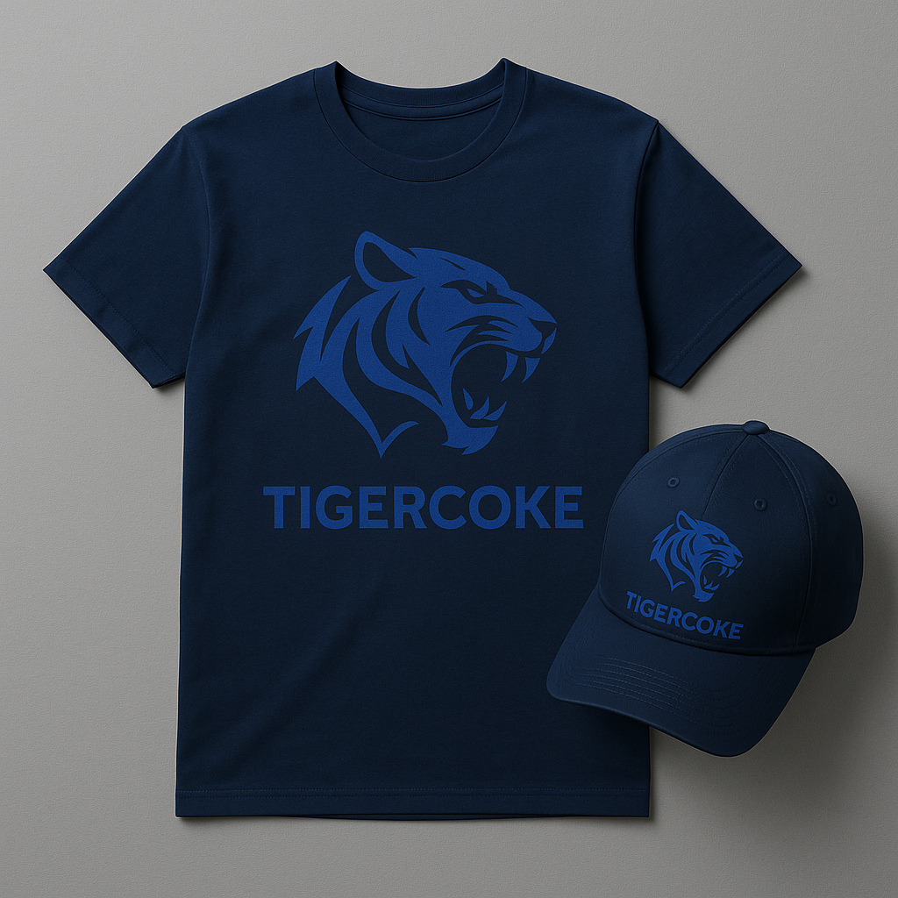

# Laboratorio 6

## Actividad 1

1.  Generar la estrategia de marketing

    - #### Prompt
      Genera una estrategia de marketing para una empreza de bebidas energeticas llamada TigerCoke. La estructura de la estrategia debe ser clara y bien definida. Hazla en un parrafo de 20 lineas o menos.
    - #### Respuesta
      TigerCoke es una marca de bebidas energéticas dirigida a jóvenes entre 16 y 30 años que buscan potencia, concentración y estilo. Su propuesta de valor se basa en despertar la “bestia interior” con sabores intensos, ingredientes funcionales y un diseño visual feroz. La estrategia de marketing se enfoca en un branding impactante, con latas coleccionables y un eslogan poderoso: _“Despierta a tu bestia interior”_. Se ofrecerán diferentes líneas de producto como TigerCoke Classic, Zero y Focus, incluyendo ediciones limitadas en colaboración con influencers. La distribución abarcará tiendas físicas, vending machines en universidades, e-commerce propio y plataformas como Amazon. La comunicación será digital, utilizando Instagram, TikTok y YouTube Shorts con contenido dinámico, retos virales (#DespiertaTuBestia), y campañas con microinfluencers. Se realizarán activaciones físicas en eventos de eSports, música y deporte, junto a promociones de lanzamiento como combos 2x1 y sorteos de consolas y viajes. La marca destinará su presupuesto principalmente a contenido digital, publicidad pagada y eventos presenciales. Los KPIs clave incluirán ventas mensuales, engagement, tasa de recompra y menciones de marca. El objetivo a corto plazo es alcanzar 100,000 latas vendidas en 6 meses y convertirse en una de las 3 marcas líderes en su categoría en 2 años. TigerCoke es energía con identidad.

2.  Estructurar la estrategia y pulir detalles

    - #### Prompt
      Centra la propuesta a información menos técnica, como alcance, publico, objetivo, estrategia digital entre otras, la idea es implementar las 4 secciones más relevantes.
    - #### Respuesta
      TigerCoke es una bebida energética pensada para jóvenes entre 16 y 30 años que buscan energía, actitud y autenticidad en su día a día. Su público abarca estudiantes, gamers, deportistas y personas que necesitan mantenerse activos mental y físicamente. El objetivo principal es posicionar a TigerCoke como una marca vibrante, rebelde y cercana a las nuevas generaciones, logrando una comunidad fuerte y leal en los primeros 6 meses. Para lograrlo, se implementará una estrategia digital enfocada en redes sociales como TikTok, Instagram y YouTube, creando contenido viral, retos interactivos (#DespiertaTuBestia), y colaboraciones con influencers emergentes y streamers. Además, se buscará estar presentes en la vida diaria del público mediante activaciones en universidades, eventos gamer y festivales urbanos, regalando muestras y merch exclusivo. Las campañas se centrarán en el impacto visual, el lenguaje juvenil y el poder de la identidad individual. La marca tendrá un fuerte enfoque en la interacción, respondiendo a la comunidad y construyendo una cultura en torno a la energía y el empoderamiento. El alcance inicial busca llegar a más de 500 mil personas en los primeros meses mediante contenido pagado y orgánico. Con una presencia creativa y auténtica, TigerCoke apunta a convertirse en la bebida energética favorita de la nueva generación.

3.  Generar mockups del producto

    - #### Prompt
      Crea el logo de la empresa teniendo en cuenta que debe ser un tigre con la boca abierta, trata de que sea minimalista, tipo líneas y sombras y ten en cuenta los colores de la empresa que son negro y azul rey oscuro
    - #### Respuesta
      
    - #### Prompt
      haz un mockup del producto en una camisa y en una gorra
    - #### Respuesta
      
