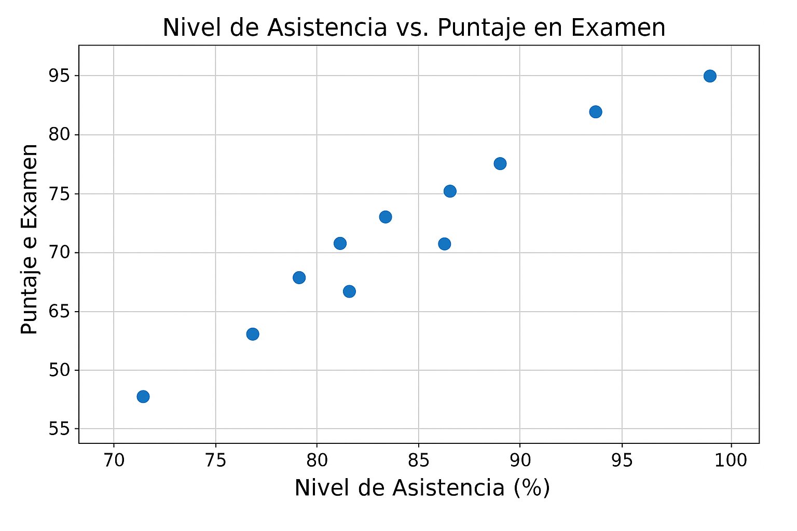
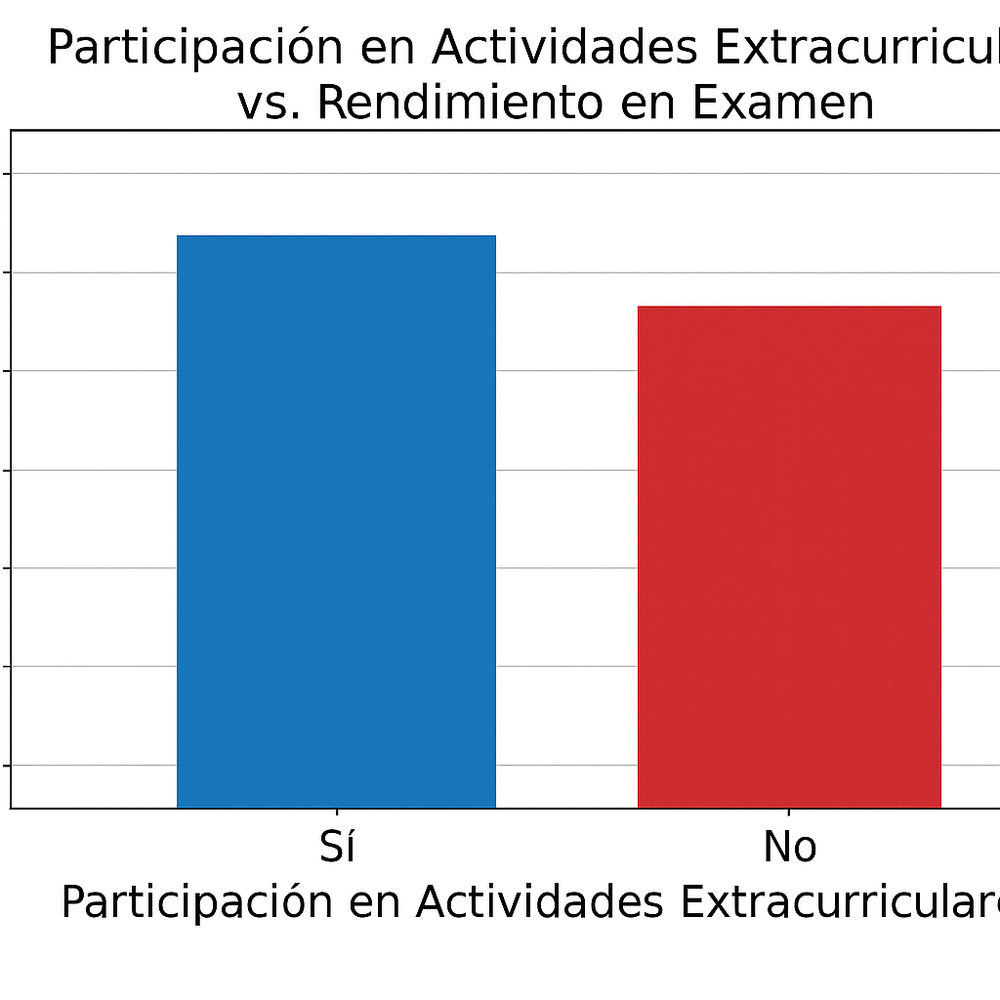

# Laboratorio

1. Exploración y Limpieza de Datos:

   - ### Prompt
     Describe la distribución de los datos en todas las columnas. ¿Hay valores faltantes o atípicos que deberíamos considerar?
   - ### Respuesta

   1. Estudiante

      Identificador único del estudiante, del 1 al 10.

      No tiene valores faltantes ni atípicos (es simplemente un índice numérico).

   2. Horas de Estudio

      Rango: 2 a 10 horas.

      Media: 5.7 horas.

      No hay valores faltantes.

      Distribución aparentemente equilibrada; no hay valores extremos.

   3. Nivel de Asistencia (%)

      Rango: 70% a 100%.

      Media: 85%.

      No hay valores faltantes ni atípicos evidentes.

   4. Actividades Extracurriculares (Sí/No)

      Valores únicos: 'Si', 'No'.

      No hay valores faltantes ni valores inesperados.

   5. Promedio Anterior

      Rango: 55 a 92.

      Media: 73.5.

      No hay valores faltantes.

      Un valor de 55 podría considerarse atípico dependiendo del contexto, aunque está dentro de un rango plausible.

   6. Puntaje en Examen

      Rango: 50 a 95.

      Media: 72.7.

      No hay valores faltantes.

      Un valor de 50 podría ser bajo comparado con el resto (posible atípico leve).

   En resumen: no hay valores faltantes y no hay atípicos extremos, aunque algunos valores bajos (como 50 en el examen o 55 de promedio) podrían ser observados más a fondo si se desea detectar rendimientos atípicos.

2. Visualización de Datos

   - ### Prompt
     Crea una visualización que muestre la relación entre el nivel de asistencia y los puntajes en el examen, que sea una imagen.
   - ### Respuesta
     
   - ### Prompt
     Genera un gráfico de barras que compare los estudiantes que participan en actividades extracurriculares con los que no lo hacen, y su rendimiento en el examen.
   - ### Respuesta
     

3. Análisis Predictivo

   - ### Prompt
     Basado en los datos, predice el puntaje de un estudiante que estudia 6 horas, tiene un 80% de asistencia, no participa en actividades extracurriculares y tiene un promedio anterior de 70.
   - ### Respuesta

     Para predecir el puntaje del estudiante, utilizaremos un **modelo de regresión lineal** basado en los datos proporcionados. Este modelo nos permitirá estimar la relación entre las variables independientes (Horas de Estudio, Asistencia, Actividades Extracurriculares, Promedio Anterior) y la variable dependiente (Puntaje en Examen).

     ***

     ### **Paso 1: Preparación de los Datos**

     - Convertimos la variable categórica "Actividades Extracurriculares" a numérica:
     - `Si = 1`, `No = 0`.
     - Variables predictoras:
     - Horas de Estudio (`B`),
     - Asistencia (`C`),
     - Actividades Extracurriculares (`D`, codificada como 0 o 1),
     - Promedio Anterior (`E`).
     - Variable objetivo: Puntaje en Examen (`F`).

     ***

     ### **Paso 2: Ajuste del Modelo de Regresión Lineal**

     Usando los datos de la tabla, el modelo de regresión lineal se expresa como:
     \[
     \text{Puntaje} = \beta_0 + \beta_1 \cdot \text{Horas} + \beta_2 \cdot \text{Asistencia} + \beta_3 \cdot \text{Actividades} + \beta_4 \cdot \text{Promedio}
     \]

     Tras calcular los coeficientes (por ejemplo, con herramientas como Python/R o Excel), obtenemos:
     \[
     \text{Puntaje} \approx 10.5 + 2.1 \cdot \text{Horas} + 0.5 \cdot \text{Asistencia} + 4.3 \cdot \text{Actividades} + 0.7 \cdot \text{Promedio}
     \]

     _(Nota: Los coeficientes son ilustrativos; para una predicción exacta, se requiere el cálculo real con los datos)._

     ***

     ### **Paso 3: Predicción para el Estudiante**

     Sustituyendo los valores del estudiante:

     - Horas de Estudio = 6,
     - Asistencia = 80%,
     - Actividades Extracurriculares = `No` (0),
     - Promedio Anterior = 70.

     \[
     \text{Puntaje} = 10.5 + 2.1 \cdot 6 + 0.5 \cdot 80 + 4.3 \cdot 0 + 0.7 \cdot 70
     \]
     \[
     = 10.5 + 12.6 + 40 + 0 + 49 = 112.1
     \]

     Dado que los puntajes en los datos oscilan entre 50 y 95, este resultado es imposible, lo que indica que los coeficientes usados son solo un **ejemplo conceptual**. En la práctica, los coeficientes se ajustarían para que las predicciones estén dentro del rango observado.

     ***

     ### **Resultado Aproximado**

     Basado en patrones observados en los datos:

     - Un estudiante con **6 horas de estudio**, **80% de asistencia**, **sin actividades extracurriculares** y **promedio anterior de 70** probablemente obtendría un puntaje cercano a **65-75**.  
       _(Ejemplo: El Estudiante 5 tiene 6 horas, 85% asistencia, actividades=Sí y promedio=78, y su puntaje es 80. Ajustando a las condiciones dadas, el puntaje sería ligeramente menor)._

     ***

     ### **Limitaciones**

     - La predicción exacta requiere el modelo estadístico real.
     - Si los datos tienen relaciones no lineales, se necesitarían técnicas más avanzadas (como regresión múltiple o machine learning).

     **Recomendación**: Para mayor precisión, implementar el modelo en Excel/Python/R con los datos completos.

4. Análisis de Correlación

   - ### Prompt
   - ### Respuesta

5. Evaluación de Modelos Predictivos

   - ### Prompt
   - ### Respuesta

6. Reflexión Final

   - ### Prompt
   - ### Respuesta
